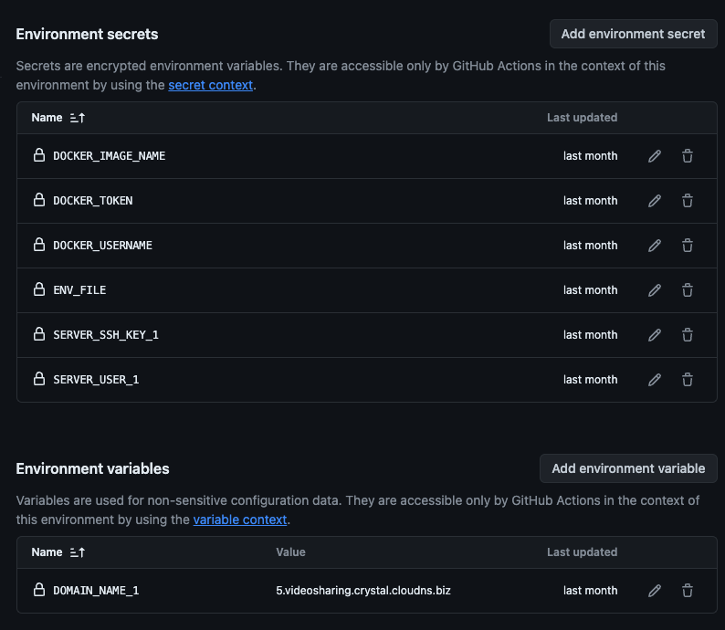

# Getting Started with Create React App
This is project for people can share any youtube videos. And other logged in use can receive notification when someone share new video.

## Get up
1. Clone repo `git clone https://github.com/SJS-Crystal/youtube_video_sharing_react.git`
2. Create .env file from .env.sample
2. `cd youtube_video_sharing_react` and run `docker-compose up`
=> It should run in http://localhost:4000/

## Run test
1. `docker-compose run frontend npm test`

## Deployment

### Prerequirement:
- Make sure you have server with ubuntu 22.04(or later) and domain
- Point your domain to server ip
- In repo, **Settings > Environments**, create 4 environments in repo for contain env variables, secrets: `production`, `development`, `test`, `staging`
- Create 4 environments to restrict deploying: `approval_production_deloyment`, `approval_staging_deloyment`, `approval_test_deloyment`, `approval_development_deloyment`
- Create 2 environments to restrict merging PR into `develop` and `main` branch: `approval_merge_main_branch`, `approval_merge_develop_branch`
- Restrict people can approve deploying and approval merging by config environments: `approval_production_deloyment`, `approval_staging_deloyment`, `approval_test_deloyment`, `approval_development_deloyment`, `approval_merge_main_branch`, `approval_merge_develop_branch`

- In **Settings > Branchs**, create theses 4 rules for make sure github workflow work in correct flow

- `main` rule

- `release*` rule

- `develop` rule

- In repo, **Settings > Tags**, create new rule with pattern `*` to protect all tag, only admin can create new tag for release production

### Preparing
#### Config server credentials
1. Create ssh key: run `ssh-keygen` and follow assist prompt, and you have a public key and private key.
2. Copy SSH public key to server: `ssh-copy-id -i <path_to_publib_key> <username>@<host_ip>`.Example: `ssh-copy-id -i ~/.ssh/id_rsa.pub root@188.166.236.134`
3. If this is first time you connect to this server, maybe you see a prompt like **Are you sure you want to continue connecting (yes/no)?**, let type `yes` > Enter
4. `cat ~/.ssh/id_rsa` to get ssh private key and copy this and set **SERVER_SSH_KEY_1** secret on github. (*you can adjust ~/.ssh/id_rsa to your file you create above*)
5. Set **SERVER_HOST_1**, **SERVER_USER_1** environment secrets on every github environment
6. Set **DOMAIN_NAME_1** environment variables on every github environment

#### Create Docker hub
- Login https://hub.docker.com/ and create a new repository
- In every github environment, set your **DOCKER_USERNAME** to your docker username
- In every github environment, set your **DOCKER_USERNAME** to your docker repository name
- Access to your docker profile > Security > New Access Token, make sure select `Read & Write` permissions, now you have docker access token
- In every github environment, set your **DOCKER_TOKEN** to your docker access token
- In every github environment, set **ENV_FILE** secret to content in .env file corresponding

    ENV in every environment: `production`, `development`, `test`, `staging` should look like this

  

    In `development` environment, can use many servers for deploying many feature branchs. It looks like this:

  

### Deploy
#### Development
- Create PR to `develop` branch and comment this command in Conversation tab of PR `/build_and_deploy_s<SERVER NUMBER>`.

Example: Comment `/build_and_deploy_s1` for deploy to server 1, `/build_and_deploy_s2` for deploy to server 2 ...

#### Production
- Create new tag with form `v*.*.*` and target branch or commit need release and click `Publish release` button. CD Workflow will be triggered to build and deploy to production 

